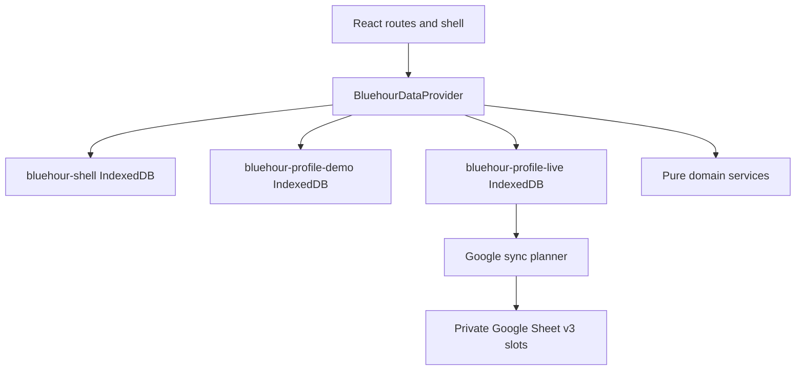

# Architecture

Bluehour is a static React + TypeScript app hosted on GitHub Pages. It is local-first: IndexedDB is the working store and Google Sheets is an optional remote backup/sync target for the live profile only.

## Application State

The shell database stores only active mode and onboarding metadata. Supported states are:

- `welcome`
- `demo`
- `setup`
- `ready_for_salary`
- `live`
- `needs_google_reconnection`
- `sync_conflict`
- `read_only_recovery`

## Storage Isolation

- Demo profile: `bluehour-profile-demo`
- Live profile: `bluehour-profile-live`
- Shell metadata: `bluehour-shell`
- Legacy database: `bluehour-local`

The legacy database is detected where browser support allows it, but is not opened for migration or clearing by normal startup.

## Clock Model

Demo mode uses a deterministic clock. Live mode uses the current browser-local date. Forms receive the active `asOfDate` from the provider instead of hardcoding production dates.

## Notable Decisions

- Starter live categories are production taxonomy records, not fictional financial records.
- Demo mutations are local-only and never enter the sync outbox.
- Google sync actions are disabled in demo before token request.
- Forecasting is split between the safe-to-spend reserve calculation and a pure projected cash-flow engine. Salary boundaries are represented as explicit projection segments so payday belongs to the future cycle.
- Budget Coach is a pure domain recommendation engine under `src/domain/budgets`. React, IndexedDB, Google Sheets, and browser APIs only provide inputs, render explanations, and persist explicit user approvals.
- Budget Coach recommendations are transient. The app persists only coaching preferences inside the validated `preferences` setting and accepted allocation records after the user approves them.
- Import duplicate review is durable domain data (`ImportRowAudit`), not a transient UI session. Every imported row receives an auditable outcome.
- Main routes are lazy-loaded to keep the first Vite chunk below the warning threshold without changing `chunkSizeWarningLimit`.

## Budget Coach Flow

Budget Coach calculates in this order:

1. Main salary only.
2. Known commitments from plan-reserved expenses and subscriptions not already represented by plans.
3. Essential flexible minimums.
4. Profile protected target, with the configured minimum protected rate remaining authoritative.
5. Safety buffer as retained cash, using `max(configured minimum, configured percentage of commitments plus essential minimums)`.
6. Feasibility and shortfall.
7. Essential comfort top-ups by priority weights.
8. Discretionary allocation by priority weights.
9. Unallocated safe-to-spend.

Completed closed cycles can supply category medians for recommendations. Open cycles, archived records, transfers, reconciliation-only adjustments, and refund reversals that do not represent spending are excluded by the existing category-actual calculation path.
