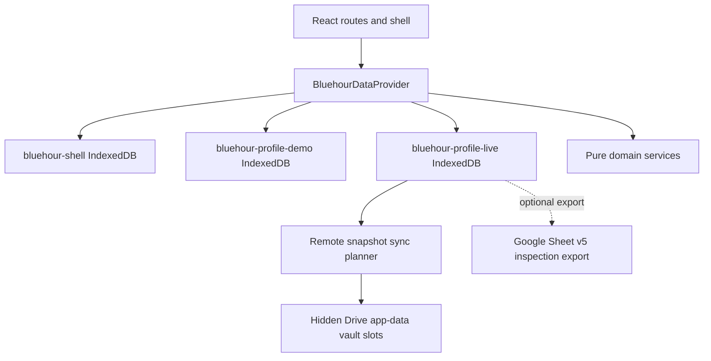

# Architecture

Bluehour is a static React + TypeScript app hosted on GitHub Pages. It is local-first: IndexedDB is the working store and a hidden Google Drive `appDataFolder` vault is the primary cross-browser source of truth for the live profile only when Google sync is connected.

## Application State

The shell database stores only active mode and onboarding metadata. Supported states are:

- `welcome`
- `demo`
- `connect_existing`
- `setup`
- `ready_for_salary`
- `live`
- `needs_google_reconnection`
- `sync_conflict`
- `read_only_recovery`

## Storage Isolation

- Demo profile: `bluehour-profile-demo`
- Live profile: `bluehour-profile-live`
- Shell metadata: `bluehour-shell`
- Legacy database: `bluehour-local`

The legacy database is detected where browser support allows it, but is not opened for migration or clearing by normal startup.

## Cross-Device Recovery

The browser-local shell database remains local and is not mirrored to Google. Cross-device resume is driven by the synced `profileManifest` settings record in the Drive vault. Onboarding commands update the local shell state and the manifest checkpoint together so another device can resume at `accounts`, `income`, `obligations`, `budget`, `wait_salary`, `start_cycle`, or the live app after the profile has been synced.

The Continue-with-Google recovery flow is intentionally read-only until confirmation:

1. Connect Google with profile and Drive app-data scopes.
2. Ensure the three hidden app-data files exist.
3. Read the Drive vault manifest, active slot envelope, records, and synced profile manifest.
4. Validate schemas and show counts/status without balances or transaction descriptions.
5. Require confirmation before replacing local live data.
6. Reconstruct live IndexedDB and shell state from the manifest.

Optional legacy v1/v2/v3/v4 Sheets and current v5 Sheets remain inspection/export sources, not the primary recovery path.

## Clock Model

Demo mode uses a deterministic clock. Live mode uses the current browser-local date. Forms receive the active `asOfDate` from the provider instead of hardcoding production dates.

## Notable Decisions

- Starter live categories are production taxonomy records, not fictional financial records.
- Demo mutations are local-only and never enter the sync outbox.
- Google Drive vault actions are disabled in demo before token request.
- Google pushes use optimistic concurrency: the Drive vault revision read immediately before push must match the expected revision. If it changed, Bluehour blocks the push and asks the user to check/pull/resolve first.
- Profile IDs are merge boundaries. Matching IDs use the normal sync planner; different IDs require explicit replace or cancel.
- Forecasting is split between the safe-to-spend reserve calculation and a pure projected cash-flow engine. Salary boundaries are represented as explicit projection segments so payday belongs to the future cycle.
- Extra-income protected allocations are explicit domain records. They reduce safe-to-spend while pending and require a confirmed protected transfer link before completion.
- Savings Coach is a pure domain layer under `src/domain/coach`. React renders insights and persists only explicit user actions such as purchase checks, goal records, pending contributions, and insight decisions.
- Pending savings-goal contributions reduce safe-to-spend and projected protected reserves until the user records or links the protected transfer.
- Budget progress is derived from one shared domain model for Overview and Budgets, including spent amounts, future reserved plans, and overspend states.
- Budget Coach is a pure domain recommendation engine under `src/domain/budgets`. React, IndexedDB, Google sync/export adapters, and browser APIs only provide inputs, render explanations, and persist explicit user approvals.
- Budget Coach recommendations are transient. The app persists only coaching preferences inside the validated `preferences` setting and accepted allocation records after the user approves them.
- Import duplicate review is durable domain data (`ImportRowAudit`), not a transient UI session. Every imported row receives an auditable outcome.
- Daily Review tasks are generated from domain records and persisted as review sessions only when the checklist changes.
- Main routes are lazy-loaded to keep the first Vite chunk below the warning threshold without changing `chunkSizeWarningLimit`.

## Budget Coach Flow

Budget Coach calculates in this order:

1. Main salary only.
2. Known commitments from plan-reserved expenses and subscriptions not already represented by plans.
3. Essential flexible minimums.
4. Profile protected target, with the configured minimum protected rate remaining authoritative.
5. Safety buffer as retained cash, using `max(configured minimum, configured percentage of commitments plus essential minimums)`.
6. Feasibility and shortfall.
7. Essential comfort top-ups by priority weights.
8. Discretionary allocation by priority weights.
9. Unallocated safe-to-spend.

Completed closed cycles can supply category medians for recommendations. Open cycles, archived records, transfers, reconciliation-only adjustments, and refund reversals that do not represent spending are excluded by the existing category-actual calculation path.

## Savings Coach Flow

Savings Coach calculates in this order:

1. Read `savingsCoach` preferences from the existing preferences setting.
2. Build spending leak insights from budget pacing, cycle deltas, small purchases, merchants, subscriptions, recurring rules, and extra-income allocation records.
3. Evaluate purchase checks against safe-to-spend and shared budget-progress rows.
4. Build savings-goal progress from active goals and completed/manual contributions.
5. Suggest Save-the-Difference amounts only from discretionary envelope underspend.
6. Build the end-of-cycle review from protected target, completed protected transfers, pending savings holds, goals, insights, and difference opportunities.

All outputs are deterministic and local. No Savings Coach recommendation is applied without a user action.
