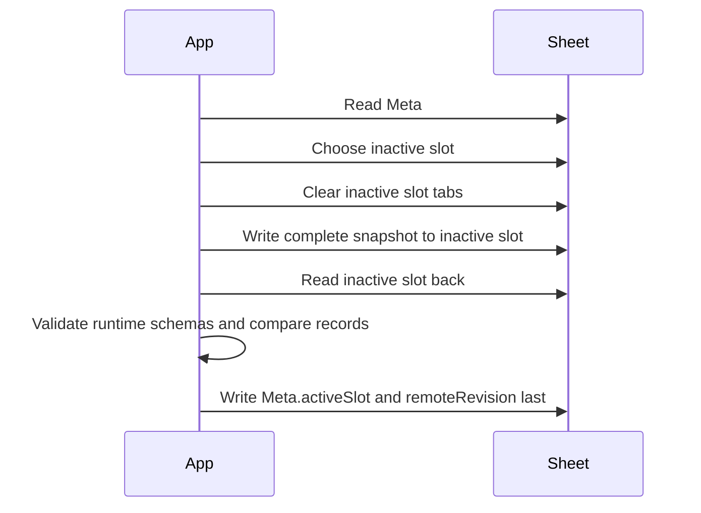

# Google Sync

Google Sheets is an app-managed remote store for the live profile. Demo mode cannot create, push, pull, or sync a Google Sheet.

## OAuth

- Client ID comes from `VITE_GOOGLE_CLIENT_ID`.
- The client ID is public configuration, not a secret.
- Requested scope: `https://www.googleapis.com/auth/drive.file`.
- Access tokens are kept in memory only and cleared after user-initiated actions.

## Sheet Schema

Current Google Sheet schema version: `3`.

Tabs:

- `Meta`
- `A_Accounts` through `A_Settings`
- `B_Accounts` through `B_Settings`

Schema v3 adds `ImportRowAudits` to both slots. v1 single-slot and v2 slot Sheets remain readable as migration sources in mocked tests; schema preparation adds missing v3 tabs without deleting legacy tabs or rows.

`Meta` stores:

```text
schemaVersion
remoteRevision
exportedAt
activeSlot
committedAt
```

## Staged Push



If inactive-slot writing or verification fails, the previous active slot remains intact. `Meta.activeSlot` is written last.

## Pull

Pull reads `Meta`, selects `activeSlot`, reads only active-slot tabs, and deserializes them into domain-shaped records through runtime schemas. Unsupported newer schema versions enter read-only recovery rather than applying data locally.

## Testing

Automated tests use mocked fetch responses. No automated test requires real Google credentials.

Real Google OAuth, deployed-origin authorization, and live Sheet A/B-slot observation remain manual release gates for stable `1.0.0`; see `docs/RC_CHECKLIST.md`.
