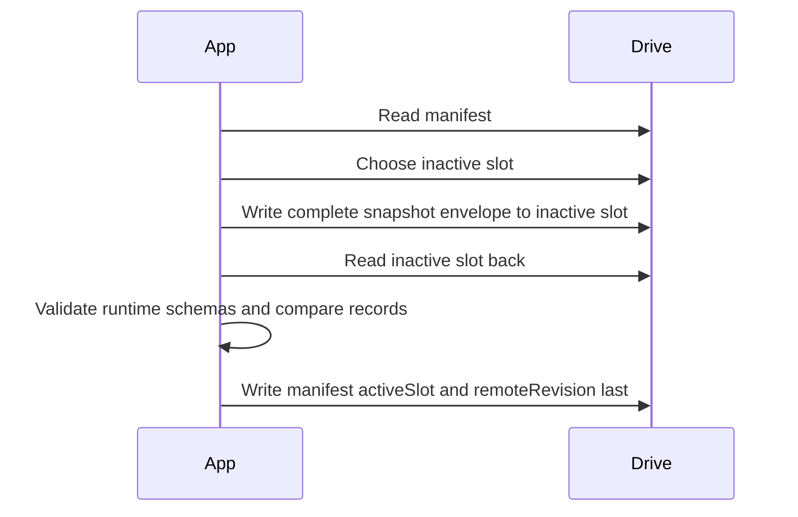

# Google Sync

Google Drive `appDataFolder` is the primary cross-browser remote store for the live profile. IndexedDB remains the working offline cache in each browser. Demo mode cannot create, push, pull, or sync a Drive vault.

Google Sheets are optional export/inspection only. They are not used for login, onboarding, or daily sync.

## OAuth

- Client ID comes from `VITE_GOOGLE_CLIENT_ID`.
- The client ID is public browser configuration, not a secret.
- Primary requested scopes: `openid`, `email`, `profile`, and `https://www.googleapis.com/auth/drive.appdata`.
- Optional Google Sheet export requests `https://www.googleapis.com/auth/drive.file` only when the user presses the export action.
- Access tokens are kept in memory only. They are reused inside the current tab for up to one hour, then discarded so the user must reconnect before automatic sync continues.
- Bluehour stores non-secret Google account metadata, Drive app-data file IDs, and remote revision details locally. It does not persist OAuth access tokens or refresh tokens.

## Drive Vault Schema

Current Drive vault schema version: `1`.

The vault uses three hidden Drive app-data files:

- `bluehour-manifest.json`
- `bluehour-slot-A.json`
- `bluehour-slot-B.json`

`bluehour-manifest.json` stores:

```text
kind
schemaVersion
remoteRevision
activeSlot
profileId
appVersion
committedAt
lastWrittenByDeviceId
files
```

Each slot stores a runtime-validated `BluehourSnapshot` subset with synced domain stores only. Outbox operations, conflicts, sync state, and shell state are local coordination data and are not uploaded as snapshot records.

The synced profile manifest remains a validated `profileManifest` row in the existing `settings` store. It describes lifecycle and onboarding resume state without storing Google email, account numbers, device labels, hardware IDs, or IP addresses.

## Staged Push



If inactive-slot writing or verification fails, the previous active slot remains intact. The manifest is written last.

Before push, Bluehour compares the expected remote revision with the current manifest revision. If the values differ, the push fails with `remote_revision_changed`; Bluehour must inspect the newer remote revision before any local outbox is pushed.

## Pull

Pull reads the manifest, selects the active slot, reads that slot, and deserializes records through runtime schemas. Unsupported newer schema versions enter read-only recovery rather than applying data locally.

On first sign-in from a new browser:

1. Bluehour ensures the three app-data files exist.
2. If the vault contains a profile, Bluehour validates it and atomically rebuilds `bluehour-profile-live` after confirmation when needed.
3. If no vault exists and the browser has no meaningful live profile, Bluehour creates the live profile locally and writes the first staged snapshot to Drive.
4. If local and remote profile IDs differ, automatic merge is blocked.

## Cross-Device Rules

- The local `bluehour-shell` database is not uploaded.
- The remote `profileManifest` describes lifecycle and onboarding resume state.
- Possible local changes stay in the outbox until a Google session is active. While the one-hour in-memory session is active, Bluehour automatically syncs queued live changes to the Drive vault.
- Sync reads remote metadata and records before pushing local outbox changes.
- Non-conflicting remote changes apply locally while preserving local outbox changes.
- Same-record concurrent edits create explicit conflicts that survive reload.
- Different profile IDs block automatic merge.
- Disconnecting one browser clears the local connection descriptor and memory token only; it preserves local data, pending outbox changes, the remote Drive vault, and other browsers.

## Session Gatekeeper

Bluehour does not store refresh tokens. The current browser tab may reuse an access token in memory for up to one hour. After expiry, automatic sync pauses with a reconnection message. Pressing Sync Drive vault or Save progress to Google starts a new Google token request; if Google can satisfy it from the browser's existing Google session, the user may not need to choose the account again.

## Optional Sheet Export

Settings can create or update a Google Sheet for manual inspection. Sheet schema v4 uses `Meta`, active/inactive tabs, runtime validation, read-back comparison, and the `ExtraIncomeAllocations` tab. Legacy v1, v2, and v3 Sheets remain readable as mocked migration sources for inspection/export work, but Sheets are no longer the primary sync source.

## Testing

Automated tests use mocked Google Identity, Drive, and Sheets responses. No automated test requires real Google credentials.

Real Google OAuth, deployed-origin authorization, and live Drive app-data vault observation remain manual release gates for stable `1.0.0`; see `docs/RC_CHECKLIST.md`.
