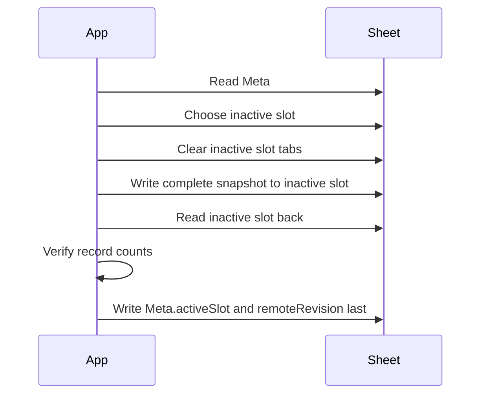

# Google Sync

Google Sheets is an app-managed remote store for the live profile. Demo mode cannot create, push, pull, or sync a Google Sheet.

## OAuth

- Client ID comes from `VITE_GOOGLE_CLIENT_ID`.
- The client ID is public configuration, not a secret.
- Requested scope: `https://www.googleapis.com/auth/drive.file`.
- Access tokens are kept in memory only and cleared after user-initiated actions.

## Sheet Schema

Current Google Sheet schema version: `2`.

Tabs:

- `Meta`
- `A_Accounts` through `A_Settings`
- `B_Accounts` through `B_Settings`

`Meta` stores:

```text
schemaVersion
remoteRevision
exportedAt
activeSlot
committedAt
```

## Staged Push



If inactive-slot writing or verification fails, the previous active slot remains intact.

## Pull

Pull reads `Meta`, selects `activeSlot`, reads only active-slot tabs, and deserializes them into domain-shaped records. Legacy single-slot sheets can still be read for local import/migration work, but the non-destructive migration UI is not complete yet.

## Testing

Automated tests use mocked fetch responses. No automated test requires real Google credentials.
